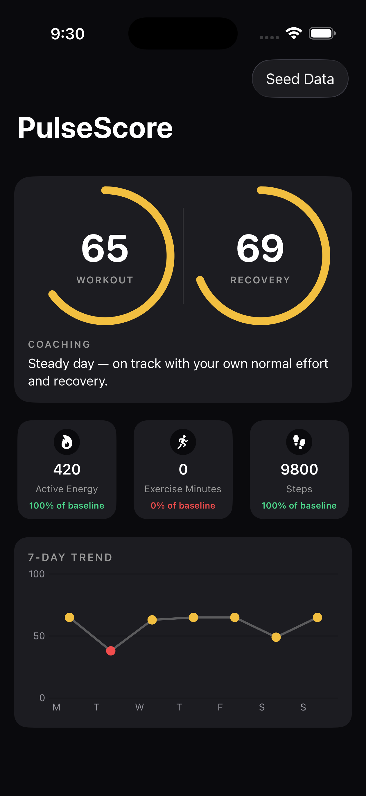

# Rebase

A SwiftUI iOS app that turns your Apple Health activity into a single, explainable daily **Workout Score** and **Recovery Score** — scored against *your own* rolling baseline, not a fixed target.



*(Debug build, with the Simulator's HealthKit store seeded with sample data via the in-app "Seed Data" button — see [Running it](#running-it).)*

## Concept

Most fitness apps either bury you in raw numbers or hide the math behind a black-box "readiness" score. Rebase does neither: every score comes from a formula simple enough to state in one sentence, and the dashboard shows its work — exactly what today's numbers were compared to your baseline, not just a mystery percentage.

Visually inspired by WHOOP/Bevel-style dashboards (circular score rings, dark theme, card-based breakdown), but built from scratch with an intentionally simpler, fully transparent formula.

## Scoring approach

**Workout Score** (0–100): for each of three effort metrics — active energy, exercise minutes, and steps — today's value is compared against your own trailing 7-day average:

```
score = Σ  min(today / 7-day baseline, 1.0) × weight
```

| Metric | Weight |
|---|---|
| Active Energy | 40% |
| Exercise Minutes | 35% |
| Steps | 25% |

Each metric is **capped at 100% of baseline** — matching or beating your own normal earns full credit, but there's no bonus for a single huge outlier day. That keeps one great day from making three lazy ones look fine, and keeps the number easy to explain: "you hit 100% of your own normal."

**Recovery Score** (0–100): computed completely separately, from resting heart rate alone. At or below your 7-day baseline RHR scores 100; the score falls linearly to 0 as RHR climbs 10 bpm or more above baseline. Workout and Recovery are deliberately never combined into one number — mixing an effort signal with a physiological-state signal would make the score harder to explain, and explainability is the whole point.

## Architecture

- **`ScoreEngine`** — pure Swift, zero dependency on HealthKit or SwiftUI. All scoring logic and weights live in one file, fully unit-testable without a simulator (13 XCTest cases covering baseline-capping, zero-data edge cases, missing-data handling, and determinism).
- **`HealthKitManager`** — the only part of the app that touches HealthKit. Fetches the last 14 days of activity via `HKStatisticsCollectionQueryDescriptor` (modern async HealthKit, no completion-handler bridging needed), and exposes a small `LoadState` enum (`loading` / `authorizationDenied` / `notEnoughData` / `loaded` / `failed`) that the UI switches on directly.
- **SwiftUI views** — consume only `ScoreResult` / `DailyMetrics`, never HealthKit types directly. This is what let the entire UI get built and refined against mock data *before* HealthKit was wired in at all — swapping the data source at the end required zero view changes.

```
Rebase/
├── ScoreEngine/   Pure scoring logic + weights (unit tested)
├── HealthKit/     HealthKitManager — the only HealthKit-aware code
├── Models/        DailyMetrics, ScoreResult, ScoreHistoryPoint
├── Views/         ScoreRingView, MetricCardView, TrendChartView, TodaySummaryCard, ContentView
├── Theme/         Dark, WHOOP/Bevel-inspired color system
└── Mock/          Deterministic 14-day sample data (SwiftUI previews only)
```

The Xcode project is generated from `project.yml` via [XcodeGen](https://github.com/yonaskolb/XcodeGen) rather than hand-maintained — reproducible, diffable, and keeps merge-conflict-prone generated XML out of version control (the `.xcodeproj` itself is gitignored).

## Running it

Requires Xcode 15+, iOS 17+ deployment target.

```bash
brew install xcodegen   # if you don't already have it
git clone https://github.com/Ahmadmoghrabi/Rebase.git
cd Rebase
xcodegen generate
open Rebase.xcodeproj
```

Build and run on a Simulator or device (`Cmd+R`). Real Apple Health data only appears on a **physical device** signed with your own Apple ID — the Simulator's HealthKit store is empty and fully sandboxed from any real device's history. To exercise the real HealthKit query path without real activity, a **Debug-only** "Seed Data" button (compiled out of Release builds entirely, along with the write access it requests) writes 14 days of synthetic samples into the Simulator's Health store.

Run the test suite with `Cmd+U`, or headlessly:

```bash
xcodebuild -project Rebase.xcodeproj -scheme Rebase \
  -destination 'platform=iOS Simulator,name=iPhone Air' test
```

## What I learned

- **HealthKit has real, non-obvious write restrictions.** Third-party apps cannot write to `HKQuantityTypeIdentifier.appleExerciseTime` (or Stand Time) at all — Apple reserves those specifically so apps can't fabricate progress toward a user's Activity Rings. Found this from an actual crash log, not documentation.
- **Read and write access require separate Info.plist purpose strings.** `NSHealthShareUsageDescription` covers reads only; `NSHealthUpdateUsageDescription` is a completely independent key required for any write request. Also found via a crash, not by reading ahead.
- **A "0" and "no data" are not the same thing, and conflating them is a real bug.** An early version of the empty-state check compared calendar-day counts instead of checking for actual recorded activity, so a completely empty HealthKit store rendered as a legitimate "you scored 0 today" instead of "we don't have enough data yet." Caught by actually running the app against a fresh Simulator, not by code review.
- **Modern HealthKit has native async/await support** (`HKStatisticsCollectionQueryDescriptor`, since iOS 15) that eliminates the need to manually bridge the older completion-handler query APIs with `withCheckedThrowingContinuation`.
